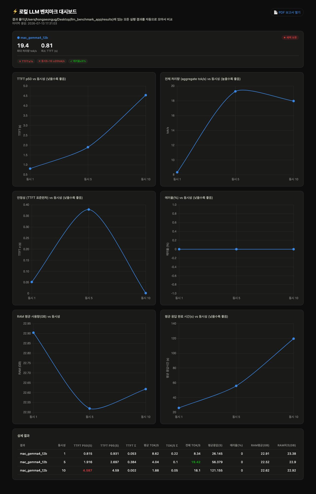
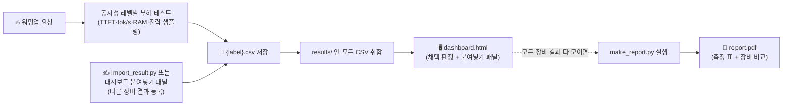

<div align="center">

# 🧪 llm-benchmark-app

**로컬 LLM 벤치마크 + 대시보드 + PDF 보고서, 올인원 CLI 한 방**

Mac과 Windows에서 같은 스크립트로 돌리고, 결과를 한 대시보드에서 나란히 비교한다.


</div>

---

## 이게 왜 필요한가

"온프레미스 로컬 LLM으로 챗봇을 돌릴 수 있을까, 아니면 클라우드 API가 나을까?"는 감이 아니라 숫자로 답해야 하는 질문이다. 이 도구는 그 숫자를 한 줄 명령으로 뽑고, 장비끼리 비교하고, 채택 여부까지 자동으로 판정해준다.

- **테스트**: OpenAI 호환 엔드포인트(llama.cpp / Ollama / vLLM)에 동시성 부하를 걸어 TTFT·처리량·안정성·에러율·메모리·전력 사용량을 측정
- **비교**: 결과 폴더를 공유하거나 대시보드에 CSV를 붙여넣으면 Mac과 Windows 결과가 한 화면에 자동으로 겹쳐 그려짐
- **판정**: 정해진 채택 기준(TTFT, tok/s, 에러율)에 따라 "온프레미스 채택 가능 / 보류"를 대시보드에서 자동 판정
- **보고**: 비교하려는 장비 결과를 다 모은 뒤 명령 하나로 `report.pdf` 생성 (중간에 미완성 보고서가 나돌지 않도록 자동 생성은 하지 않음)

## 미리보기

<p align="center">
  
</p>

## 목차

- [빠른 시작](#빠른-시작)
- [사전 준비](#사전-준비)
- [실행](#실행)
- [두 장비(Mac ↔ Windows) 비교하는 법](#두-장비mac--windows-비교하는-법)
- [최종 보고서 만들기](#최종-보고서-만들기)
- [로컬 서버로 실행하기](#로컬-서버로-실행하기)
- [CLI 옵션](#cli-옵션)
- [측정 항목](#측정-항목)
- [채택 판단 기준](#채택-판단-기준)
- [폴더 구조](#폴더-구조)
- [동작 원리](#동작-원리)
- [트러블슈팅](#트러블슈팅)

---

## 빠른 시작

```bash
pip install httpx psutil reportlab --break-system-packages

python benchmark_app.py \
  --url http://localhost:11434/v1/chat/completions \
  --model gemma4:12b \
  --label mac_gemma4_12b \
  --results-dir ./results
```

끝나면 브라우저에 대시보드가 뜨고 채택 가능/보류 판정도 바로 보인다. `report.pdf`는 자동으로 만들어지지 않는다 —
Windows 등 다른 장비 결과까지 다 모은 뒤 [최종 보고서 만들기](#최종-보고서-만들기)에서 한 번에 생성한다.

터미널 명령 대신 **브라우저에서 버튼으로 여러 번 테스트를 돌리고 싶다면** [로컬 서버로 실행하기](#로컬-서버로-실행하기)를 봐라.

## 사전 준비

**1) 벤치마크 대상 서버를 먼저 띄운다**

<table>
<tr><th>llama.cpp</th><th>Ollama</th></tr>
<tr>
<td>

```bash
./llama-server \
  -m gemma-4-E4B-Q4_K_M.gguf \
  -ngl 99 --port 8080
```

</td>
<td>

```bash
ollama serve
# --url http://localhost:11434/v1/chat/completions
```

</td>
</tr>
</table>

> [!TIP]
> Ollama로 동시 요청을 여러 개 테스트한다면 `OLLAMA_NUM_PARALLEL`을 테스트할 최대 동시성 이상으로 설정하고 재시작해야 한다. 기본값 그대로면 요청이 순차 대기열에 쌓이면서 TTFT가 비정상적으로 치솟고, 심하면 타임아웃으로 에러율이 급등한다.
> ```bash
> launchctl setenv OLLAMA_NUM_PARALLEL 10   # macOS
> setx OLLAMA_NUM_PARALLEL 10               # Windows (재시작 필요)
> ```

**2) Python 의존성 설치**

```bash
pip install httpx psutil reportlab --break-system-packages
```

| 패키지 | 용도 |
|---|---|
| `httpx` | 비동기 스트리밍 요청 |
| `psutil` | 부하 중 RAM 사용량 샘플링 |
| `reportlab` | PDF 보고서 생성 |

> [!NOTE]
> PDF 한글 폰트는 reportlab 내장 CID 폰트 대신 `assets/fonts/`에 번들된 [NanumGothic](https://github.com/google/fonts/tree/main/ofl/nanumgothic)(SIL OFL 1.1)을 사용한다. 내장 CID 폰트는 라틴 문자를 전각으로 그려 `TTFT`가 `T T F T`처럼 벌어지는 문제가 있어서 교체함 — 별도 설치 없이 저장소에 이미 포함돼 있다.

## 실행

```bash
python benchmark_app.py \
  --url http://localhost:8080/v1/chat/completions \
  --model gemma-4-E4B \
  --label mac_e4b \
  --results-dir ./results \
  --concurrency 1,5,10 \
  --num-requests 20
```

실행 순서:

1. 🔥 워밍업 요청 1회 (모델 최초 로딩 지연이 통계를 오염시키지 않도록 배제)
2. 📊 동시성 레벨별로 TTFT·처리량·안정성·에러율·RAM·전력 측정
3. 💾 `results/{label}.csv` 저장
4. 🖥️ `results/dashboard.html` 자동 생성/갱신 후 브라우저 오픈 — **실행 중에는 "테스트 진행중" 배너만 뜨고 이전 결과는 비워서 보여줌** (오래된 데이터와 혼동 방지)

`report.pdf`는 이 단계에서 만들어지지 않는다. Windows 등 다른 장비 결과까지 다 모은 뒤
[최종 보고서 만들기](#최종-보고서-만들기)에서 한 번에 생성하는 방식이다(중간에 미완성 보고서가 돌아다니는 것을 방지).

## 두 장비(Mac ↔ Windows) 비교하는 법

`--results-dir`를 Dropbox / iCloud Drive / 네트워크 공유 폴더로 지정하면, Mac과 Windows가 같은 폴더에 각자의 CSV를 쌓는다. 아무 쪽에서나 재실행하면 그 폴더의 `dashboard.html`이 폴더 안 모든 CSV를 다시 읽어 비교 차트를 그린다.

```bash
# Mac에서
python benchmark_app.py --url http://localhost:11434/v1/chat/completions \
  --model gemma4:12b --label mac_gemma4_12b --results-dir ~/Dropbox/llm_bench

# Windows에서 (같은 경로, 같은 모델)
python benchmark_app.py --url http://localhost:11434/v1/chat/completions ^
  --model gemma4:12b --label windows_gemma4_12b --results-dir ~/Dropbox/llm_bench
```

공유 폴더가 없다면, 상대편 장비에서 나온 `{label}.csv` 파일 하나만 복사해 넣어도 다음 실행 때 대시보드가 자동으로 합쳐서 비교해준다.

**파일 전송 없이 텍스트만 복사해서 등록하기** — Windows에서 CSV 파일 자체를 옮기기 번거로우면, 결과 CSV 내용을 열어서 텍스트만 복사한 뒤 등록하는 방법이 두 가지 있다.

*터미널에서:*
```bash
python import_result.py --label windows_gemma4_12b --results-dir ./results
# 프롬프트가 뜨면 복사한 CSV 내용을 붙여넣고 Ctrl+D (Windows는 Ctrl+Z 후 Enter)
```

*또는 대시보드에서 바로:* `dashboard.html`의 **"📥 결과 요약 — 다른 장비 결과 붙여넣기"** 패널에 라벨과 CSV 내용을 넣고 **"➕ 비교에 추가"**를 누르면, 그 자리에서 바로 비교 차트·표에 반영된다. 단 이건 그 브라우저 화면에서만 보이는 미리보기라 새로고침하면 사라진다 — 계속 남기려면 같은 패널의 **"💾 CSV 다운로드"**로 저장한 뒤 `results/` 폴더에 넣어라.

어느 방법이든 `{label}.csv`로 저장되고, 그 자리에서 `dashboard.html`이 갱신된다.

> [!IMPORTANT]
> 공정한 비교를 위해 두 장비 모두 **같은 모델 / 같은 quant / 같은 `OLLAMA_NUM_PARALLEL` / 같은 `--concurrency`·`--num-requests`**로 맞춰야 한다. 설정이 다르면 하드웨어 차이가 아니라 설정 차이를 비교하게 된다.

## 최종 보고서 만들기

Mac, Windows 등 비교하려는 장비 결과가 `results/` 폴더에 다 모이면, 마지막에 한 번 실행해서 `report.pdf`를 만든다:

```bash
python make_report.py --results-dir ./results
```

대시보드의 **"📄 보고서 생성 명령 복사"** 버튼을 누르면 현재 결과 폴더 경로가 채워진 이 명령이 클립보드에 복사된다 (정적 페이지라 브라우저에서 직접 PDF를 만들 수는 없어서, 명령을 복사해 터미널에 붙여넣는 방식이다).

모델을 바꿔가며(`--label mac_12b`, `--label mac_26b` 등) 반복 실행하면 대시보드에 라인이 계속 추가된다.

## 로컬 서버로 실행하기

터미널에서 매번 `python benchmark_app.py ...`를 치는 대신, 브라우저의 **"🚀 새 테스트 시작"** 버튼으로 바로 새 벤치마크를 돌리고 싶다면 서버로 띄운다.

```bash
pip install flask --break-system-packages
python server.py --results-dir ./results --port 8899
```

`http://localhost:8899`로 접속하면 평소와 같은 대시보드가 뜨는데, 상단에 실행 폼이 하나 더 있다. URL·모델·동시성·요청 수를 입력하고 "▶ 테스트 시작"을 누르면:

- 서버가 실제로 벤치마크를 실행한다(RAM·전력 샘플링 포함 — `sudo python server.py ...`로 띄우면 macOS 전력도 측정됨)
- **실행할 때마다 라벨에 타임스탬프가 자동으로 붙어**(`gemma4_12b_20260714_153000` 같은 식) 이전 기록을 덮어쓰지 않고 계속 쌓인다
- 진행 중에는 실시간 로그가 패널 아래 표시되고, 끝나면 자동으로 새로고침된다

> [!NOTE]
> `dashboard.html` 파일을 직접 더블클릭해서 여는(`file://`) 기존 방식은 여전히 그대로 동작한다 — "새 테스트 시작" 패널만 서버로 띄웠을 때 활성화되고, 파일을 직접 열면 "서버에 연결할 수 없다"는 안내만 뜨고 나머지 기능(붙여넣기 비교, 보고서 명령 복사 등)은 평소처럼 쓸 수 있다.

## CLI 옵션

| 옵션 | 기본값 | 설명 |
|---|---|---|
| `--url` | *(필수)* | OpenAI 호환 엔드포인트 |
| `--model` | *(필수)* | 모델명 |
| `--label` | *(필수)* | CSV 파일명 & 그래프 범례 (예: `mac_e4b`) |
| `--results-dir` | `./llm_benchmark_results` | 결과 저장 폴더 — 공유 폴더 지정 시 여러 장비 비교 가능 |
| `--prompt` | 배송 지연 문의 응대 예시 | 테스트에 사용할 프롬프트 |
| `--concurrency` | `1,5,10` | 콤마로 구분된 동시 요청 수 리스트 |
| `--num-requests` | `20` | 동시성 레벨당 총 요청 수 |
| `--no-browser` | - | 테스트 후 브라우저 자동 오픈 끄기 |

## 측정 항목

| 항목 | 의미 |
|---|---|
| `p50_ttft` / `p95_ttft` | 첫 토큰 응답 시간(중앙값 / 95th percentile) |
| `ttft_stddev` / `tok_stddev` | TTFT·tok/s의 표준편차(σ) — 클수록 응답 편차가 커 체감 품질이 불안정 |
| `avg_tok_per_sec` | 요청 1건이 체감하는 평균 생성 속도(**사용자 관점**) |
| `aggregate_tok_per_sec` | 해당 동시성 구간의 실제 벽시계 시간(wall-clock) 기준 총 처리량(**서버 관점**) |
| `avg_total_s` | 요청 시작~완료까지 평균 총 소요 시간 |
| `error_rate` | 타임아웃 · HTTP 에러로 실패한 요청 비율(%) |
| `ram_avg_gb` / `ram_peak_gb` | 부하 중 시스템 RAM 평균 / 피크 사용량(GB) — 장비 사양(메모리) 판단용 |
| `power_avg_w` / `power_peak_w` | 부하 중 전력 소모량 평균 / 피크(W). 측정 불가 환경에서는 `-`로 표기 (아래 참고) |

> [!NOTE]
> **전력 측정은 플랫폼별로 조건이 다르다.**
> - **Windows/Linux + Nvidia GPU**: `nvidia-smi`가 PATH에 있으면 별도 설정 없이 자동 측정됨.
> - **macOS**: `powermetrics`는 root 권한이 필요함. 측정하려면 `sudo python benchmark_app.py ...`로 실행해야 하며, 일반 권한으로 실행하면 `power_avg_w`/`power_peak_w`가 `-`로 표기된다.
> - 둘 다 지원되지 않는 환경에서는 해당 열이 `-`로 남고, 대시보드 차트·장비 비교에서는 자동으로 제외된다(측정 안 된 값으로 승패를 매기지 않음).

## 채택 판단 기준

다음 세 조건을 **모두** 만족해야 온프레미스 채택 가능으로 판정한다 (`dashboard.html`의 결과 카드에 label별로 자동 표시. `report.pdf`는 결론 없이 측정치만 담는다):

- ✅ TTFT p50 **1초 이하**
- ✅ 동시 5~10명 구간에서 사용자당(`avg_tok_per_sec`) **20 tok/s 이상**
- ✅ 에러율 **5% 이하**

하나라도 못 미치면 기준 미달로 표시된다.

## 폴더 구조

```
llm_benchmark_app/
├── benchmark_app.py      # 테스트 실행 + CSV 저장 + 대시보드 자동 생성 + PDF 생성 로직
├── server.py             # 브라우저 "테스트 시작" 버튼으로 실행하는 로컬 서버 (선택)
├── import_result.py      # 다른 장비 결과 CSV를 텍스트로 붙여넣어 등록 (CLI)
├── make_report.py        # results/ 안 모든 CSV로 report.pdf 최종 생성 (명시적으로 실행)
├── README.md
└── results/
    ├── {label}.csv        # 장비/모델별 실행 결과
    ├── dashboard.html      # 모든 CSV를 모아 그리는 비교 대시보드 (채택 판정 + 붙여넣기 패널 포함)
    └── report.pdf          # make_report.py 실행 시에만 생성 — label별 측정 표 + 장비 비교
```

## 동작 원리



## 트러블슈팅

<details>
<summary><b>동시성을 올렸더니 TTFT가 갑자기 수십 초로 튀거나 에러율이 치솟는다</b></summary>

Ollama 기본 설정은 동시 요청을 병렬로 처리하지 않고 순차 대기열로 처리한다. `OLLAMA_NUM_PARALLEL`을 테스트 최대 동시성 이상으로 설정하고 Ollama를 재시작한 뒤 다시 측정해라. ([사전 준비](#사전-준비) 참고)
</details>

<details>
<summary><b>gemma 계열(thinking 모델)인데 tok/s와 TTFT가 전부 0으로 나온다</b></summary>

thinking 모델은 응답을 `delta.content`가 아니라 `delta.reasoning` 필드로 먼저 스트리밍한다. 이 스크립트는 두 필드를 모두 인식하도록 이미 처리돼 있으니, 혹시 직접 포크해서 스트리밍 파싱 부분을 수정했다면 `reasoning` 필드도 함께 체크하고 있는지 확인해라.
</details>

<details>
<summary><b>동시성=1인데도 TTFT 표준편차(σ)가 비정상적으로 크다</b></summary>

첫 요청에 모델 최초 로딩 지연이 섞여 있을 가능성이 크다. 이 스크립트는 측정 전 워밍업 요청을 1회 실행해 이를 배제하지만, 그래도 편차가 크다면 `--num-requests`를 늘려 표본을 더 확보해라.
</details>
